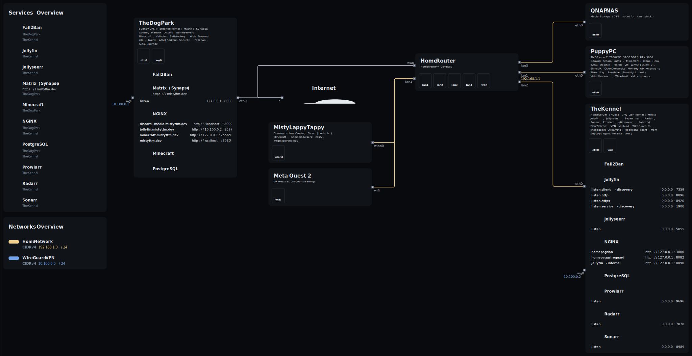
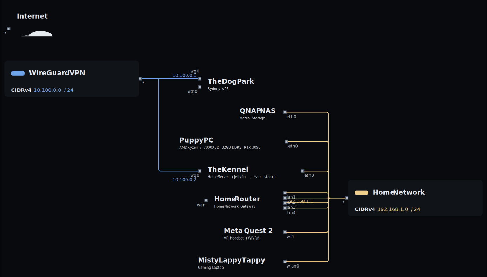

<p align="center">
  <picture>
    <source srcset="https://raw.githubusercontent.com/NixOS/nixos-artwork/refs/heads/master/logo/nix-snowflake-rainbow.svg">
    
    </img>
  </picture>
</p>

# NixOS Configs | Misty

 

[](https://github.com/Mistyttm/nixos-configs/actions/workflows/build.yml)
[](https://github.com/Mistyttm/nixos-configs/actions/workflows/update-flake.yml)
[](https://github.com/Mistyttm/nixos-configs/actions/workflows/update-topology.yml)
[](https://github.com/pre-commit/pre-commit)

This repository contains the configuration files for my NixOS systems. The configurations are managed using flakes.

See [COMMITTING.md](COMMITTING.md) for commit message guidelines.


## Directory Structure

```
.
├── flake.nix              # Flake definition and host configurations
├── hosts/                 # Per-host configurations
│   ├── puppypc/           # Main desktop
│   ├── mistylappytappy/   # Gaming laptop
│   ├── thedogpark/        # Sydney VPS
│   └── thekennel/         # Home server
├── global-configs/        # Shared configurations
│   ├── fonts/             # Font configuration
│   ├── programs/          # User programs (browsers, games, etc.)
│   ├── shell/             # Shell config (zsh, starship, etc.)
│   ├── system/            # System config (DE, networking, etc.)
│   └── users/             # User definitions
├── modules/               # Custom NixOS/home-manager modules
├── patches/               # Package patches
├── secrets/               # Encrypted secrets (sops)
└── topology/              # Infrastructure diagrams
```

## Infrastructure

<details>
<summary>Click to view network topology</summary>



</details>

<details>
<summary>Click to view network-centric diagram</summary>



</details>

> Generated with [nix-topology](https://github.com/oddlama/nix-topology). Rebuild with: `nix build .#topology.x86_64-linux.config.output`

## Hosts

### `puppypc` - Main Desktop

|              |                                                     |
| ------------ | --------------------------------------------------- |
| **Hardware** | AMD Ryzen 7 7800X3D, 32GB DDR5, RTX 3090            |
| **Kernel**   | Zen                                                 |
| **Desktop**  | KDE Plasma                                          |
| **Services** | WiVRn, SlimeVR                                      |
| **Gaming**   | Steam, Lutris, Minecraft, Clone Hero, YARG, Dolphin |

### `mistylappytappy` - Gaming Laptop

|             |                             |
| ----------- | --------------------------- |
| **Kernel**  | Zen                         |
| **Desktop** | KDE Plasma                  |
| **Gaming**  | Steam (portable), Minecraft |

### `thedogpark` - Sydney VPS

|              |                                                       |
| ------------ | ----------------------------------------------------- |
| **Kernel**   | Hardened                                              |
| **Services** | Matrix Synapse, Minecraft, nginx, WireGuard, fail2ban |

### `thekennel` - Home Server

|              |                                                                               |
| ------------ | ----------------------------------------------------------------------------- |
| **Hardware** | NVIDIA GPU (CUDA)                                                             |
| **Kernel**   | Zen                                                                           |
| **Desktop**  | KDE Plasma (Jovian)                                                           |
| **Services** | Jellyfin, Sonarr, Radarr, Prowlarr, qBittorrent, Jellyseerr, nginx, WireGuard |

## Dependencies

| Input                     | Source                                                                                                  | Description                 |
| ------------------------- | ------------------------------------------------------------------------------------------------------- | --------------------------- |
| `nixpkgs`                 | [nixos/nixpkgs](https://github.com/nixos/nixpkgs) (unstable)                                            | Main package repository     |
| `home-manager`            | [nix-community/home-manager](https://github.com/nix-community/home-manager)                             | User environment management |
| `nixpkgs-extra`           | [Mistyttm/nixpkgs-extra](https://github.com/Mistyttm/nixpkgs-extra)                                     | Custom packages             |
| `sops-nix`                | [Mic92/sops-nix](https://github.com/Mic92/sops-nix)                                                     | Secrets management          |
| `spicetify-nix`           | [Gerg-L/spicetify-nix](https://github.com/Gerg-L/spicetify-nix)                                         | Spotify theming             |
| `nix-minecraft`           | [Infinidoge/nix-minecraft](https://github.com/Infinidoge/nix-minecraft)                                 | Minecraft server management |
| `nix-vscode-extensions`   | [nix-community/nix-vscode-extensions](https://github.com/nix-community/nix-vscode-extensions)           | VSCode extensions           |
| `auto-cpufreq`            | [AdnanHodzic/auto-cpufreq](https://github.com/AdnanHodzic/auto-cpufreq)                                 | CPU frequency scaling       |
| `simple-nixos-mailserver` | [simple-nixos-mailserver/nixos-mailserver](https://gitlab.com/simple-nixos-mailserver/nixos-mailserver) | Mail server                 |
| `chaotic`                 | [chaotic-cx/nyx](https://github.com/chaotic-cx/nyx)                                                     | Chaotic-AUR Nix overlay     |
| `nixos-hardware`          | [NixOS/nixos-hardware](https://github.com/NixOS/nixos-hardware)                                         | Hardware-specific modules   |
| `pre-commit-hooks`        | [cachix/pre-commit-hooks.nix](https://github.com/cachix/pre-commit-hooks.nix)                           | Pre-commit hooks            |
| `determinate`             | [DeterminateSystems/determinate](https://flakehub.com/f/DeterminateSystems/determinate)                 | Determinate Nix             |
| `nix-topology`            | [oddlama/nix-topology](https://github.com/oddlama/nix-topology)                                         | Infrastructure diagrams     |
| `nix-cachyos-kernel`      | [xddxdd/nix-cachyos-kernel](https://github.com/xddxdd/nix-cachyos-kernel)                               | CachyOS kernel              |

## To-Do

- [ ] Enable `foodbowl` (Raspberry Pi 4) configuration
- [ ] Convert systems to btrfs
- [x] ~~Clean up commented code and leftover TODOs~~
- [x] ~~Implement secrets management~~ (sops-nix working across hosts)
- [x] ~~Add infrastructure diagrams~~ (nix-topology)
